# Power Meter Stopper

  
  
  

  <strong>The only way to disable digital electricity meters.</strong>

  
  

  
---

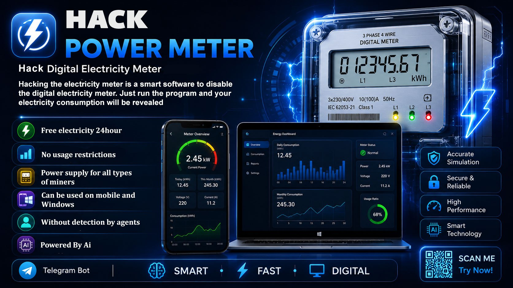

## 📱 About the App

**Power Meter Stopper** is one of the best and most powerful software for disabling electricity meters.
With this application, your digital electricity meter will be disabled and your electricity consumption will be free and you will not pay any fees for it.

---

## 🛡️ Deactivate the Power of Digital Electricity Meters with Power Meter Stopper!

## 🔑 Looking to take control of digital electricity meters?
- Power Meter Stopper is your ultimate solution! This cutting-edge software, available for both Windows and mobile devices, is engineered to bypass digital electricity meters with ease and precision.
- Renowned as one of the most powerful tools in its class, it supports a wide range of meter brands across Russia, China, and Europe, making it a global game-changer.

## 🚀 Why Choose Power Meter Stopper?
- **Seamless Compatibility:** Works with all digital electricity meters, regardless of brand or protocol.
- **User-Friendly Design:** Intuitive interface for effortless navigation, even for beginners.
- **Cross-Platform Support:** Available on all Windows versions and mobile devices for ultimate flexibility.
- **Simple Hardware Integration:** Connect your phone, tablet, or laptop to the meter with a straightforward hardware interface (build guide included!).

---

## 📸 App Screenshots

  <table>
    <tr>
      <td align="center">
        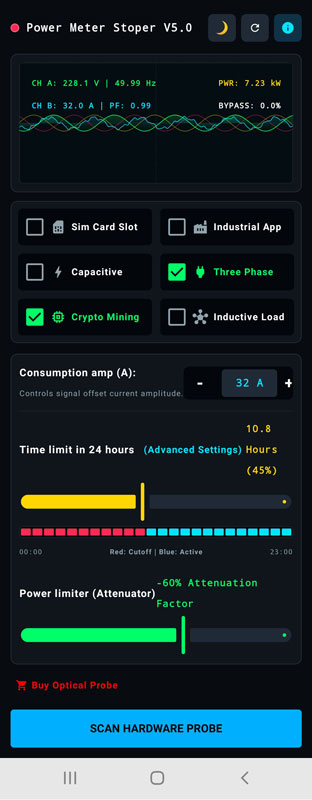
         
        <strong>Home Screen</strong>
      </td>
      <td align="center">
        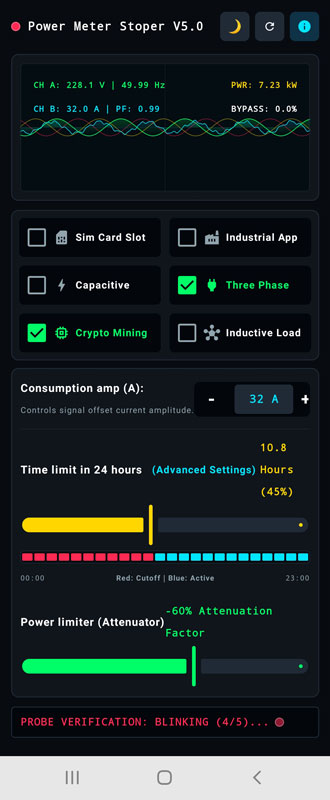
         
        <strong>Probe Virification</strong>
      </td>
      <td align="center">
        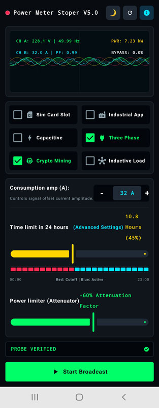
         
        <strong>Active Probe</strong>
      </td>
      <td align="center">
        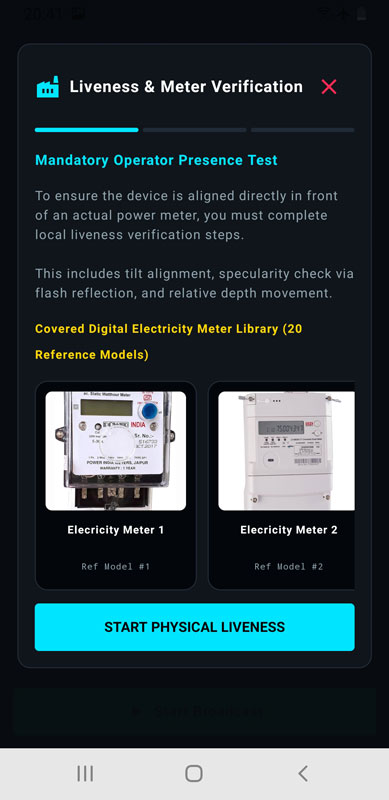
         
        <strong>Liveness Virification 1</strong>
      </td>
    </tr>
  </table>

 

  <table>
    <tr>
      <td align="center">
        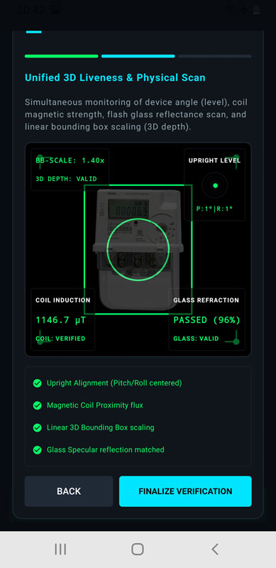
         
        <strong>Liveness Virification 2</strong>
      </td>
      <td align="center">
        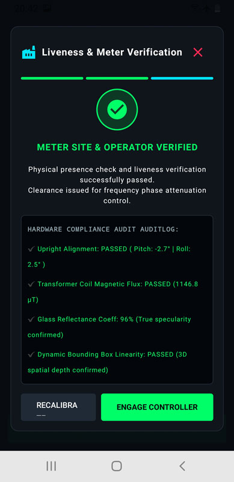
         
        <strong>Liveness Virification 3</strong>
      </td>
      <td align="center">
        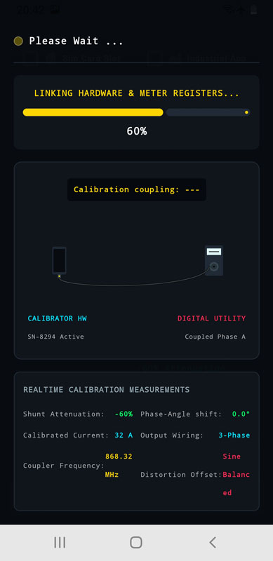
         
        <strong>Linking Hardware</strong>
      </td>
      <td align="center">
        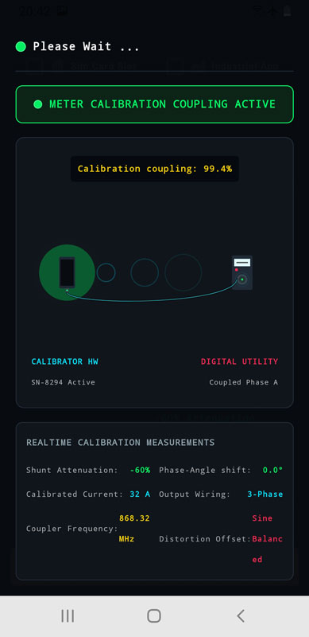
         
        <strong>Connected Meter</strong>
      </td>
    </tr>
  </table>

 

  <table>
    <tr>
      <td align="center">
        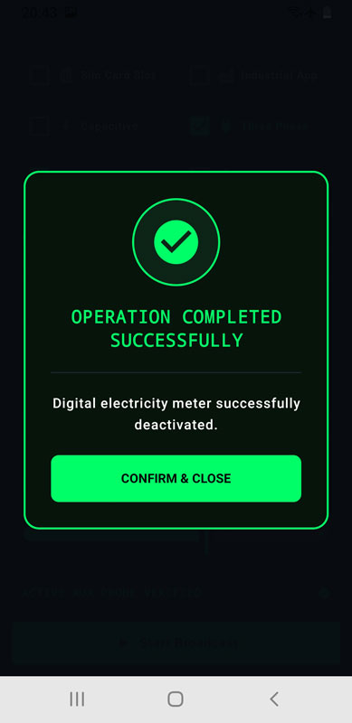
         
        <strong>Operation Completed</strong>
      </td>
      <td align="center">
        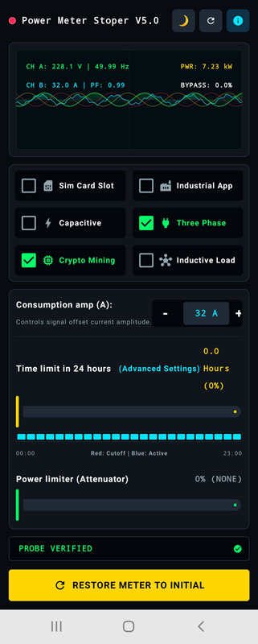
         
        <strong>Restore</strong>
      </td>
      <td align="center">
        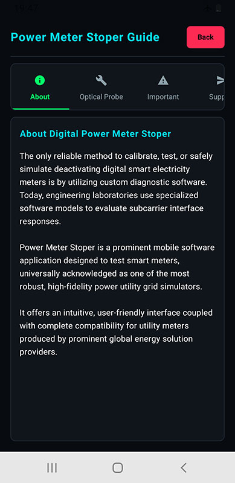
         
        <strong>About</strong>
      </td>
      <td align="center">
        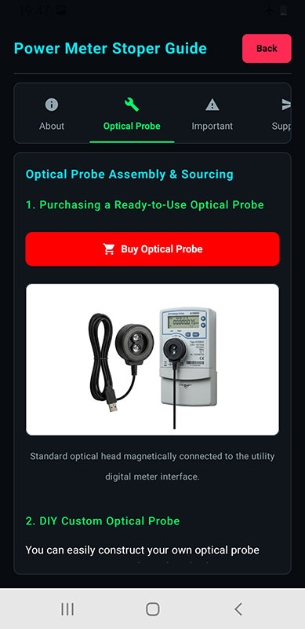
         
        <strong>Order Probe</strong>
      </td>
    </tr>
  </table>

---

## 📋 Requirements

- **Android 9.0 or higher**
- **Optical probe**
- **At least 100 MB of free storage space**

Note: A probe is required to communicate between the phone and the electricity meter. You can order and obtain the probe from within the application.

---

## 📥 Installation

### Download from Releases

1. [⬇️ Download APK](./P.M.S.apk).
2. Download APK file.
3. Install the APK file on your Android device.
4. If required, enable installation from unknown sources in your Android settings.

---

## 🚀 How to Use

1. **Make settings:** Make the program settings carefully.
2. **Connect the probe:** Connect the probe to the phone for identification.
3. **Identify the electricity meter:** Perform the steps to identify the meter.
4. **Connect the probe to the electricity meter:** Establish communication between the probe and the electricity meter.
5. **Execute the operation:** Execute the operation to disable the electricity meter.

---

## ⚠️ Disclaimer

- This application is intended for educational, research purposes only.
- Attempting unauthorized access is illegal. Users are solely responsible for ensuring that their use of this software complies with all applicable laws and regulations.
- The developers assume no responsibility for any misuse of this application.

---

## 📞 Contact

- **Telegram:** [@StopmeterBot](https://t.me/StopmeterBot)
